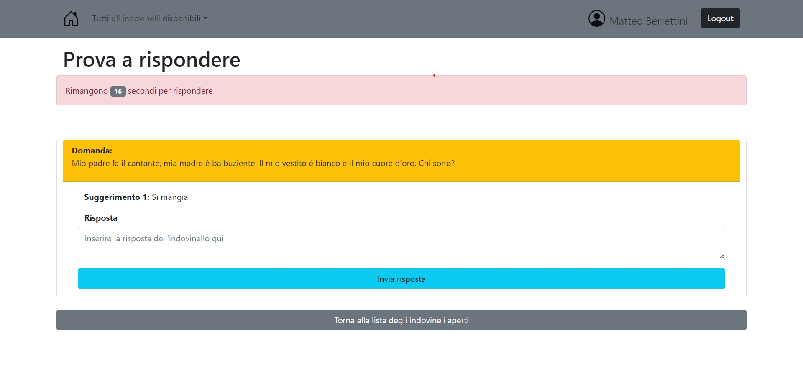

# Exam #2: "Indovinelli"
## Student: s301843 FERRARO LUCA 

## React Client Application Routes

- Route `/`: contiene la pagina principale se l'utente ha fatto il login (tabella degli indovinelli dell'utente, classifica), se l'utente è anonimo viene reindirizzato sulla pagina per fare il login
- Route `/anonymous`: contiene le informazioni disponibili (tabella indovinelli e classifica utenti) per l'utente anonimo (che non ha fatto il login)
- Route `/add`: contiene il form per aggiungere un nuovo indovinello
- Route `/login`: contiene il form per fare il login
- Route `/tuttiChiusi`: mostra la lista di tutti gli indovinelli chiusi
- Route `/tuttiAperti`: mostra la lista di tutti gli indovinelli aperti, selezionandone uno si può rispondere
- Route `/guess/:indovinelloId`: contiene il form che consente all'utente di provare a rispondere all'indovinello selezionato (che ha id=:indovinelloId) 
- Route `/aperto/:indovinelloId`: mostra le informazioni dell'indovinello aperto selezionato dalla pagina principale dell'utente 
- Route `/chiuso/:indovinelloId`: mostra le informazioni dell'indovinello chiuso selezionato dalla pagina principale dell'utente 

## API Server

- POST `/api/login`
  - request parameters and request body content
  - response body content
- GET `/api/something`
  - request parameters
  - response body content
- POST `/api/indovinello`
  - nel request body vengono messe le informazioni del nuovo indovinello creato e aggiunto nella tabella indovinelli
  - restituisce un valore logico che indica se la risposta inserita è corretta o no
- POST `/api/risposta`
  - nel request body vengono messe le informazioni della nuova risposta creata e aggiunta nella tabella risposte
- PUT `/api/newVincitore/:indovinelloId`
  - nel request body viene messo il nome dell'utente che ha risposto correttamente all'indovinello identificato dal parametro indovinelloId. Aggiorna la colonna 'vincitore' della tabella indovinelli sul db
- PUT `/api/updateInizio/:indovinelloId`
  - nel request body viene messo il timestamp relativo all'istante in cui un utente invia la prima risposta all'indovinello individuato dal parametro indovinelloid. Agiorna la colonna 'inizio' della tabella indovinelli sul db
- PUT `/api/newStatoChiuso/:indovinelloId`
  - imposta lo stato a 'chiuso' per l'indovinello identificato dal parametro indovinelloId
- GET `/api/indovinelli`
  - restituisce la lista di tutti gli indovinelli, restituisce risposta corretta e suggerimenti solo se l'indovinello è già chiuso
- GET `/api/indovinello/:id`
  - il parametro id è l'identificativo dell'indovinello
  - restituisce le informazioni dell'indovinello
- GET `/api/indovinelloRisposte/:id`
  - il parametro id è l'identificativo dell'indovinello
  - restituisce le risposte associate all'indovinello
- GET `/api/risposta/:indovinelloId`
  - il parametro id è l'identificativo dell'indovinello
  - restituisce un errore se la tabella risposte contiene già una risposta associata all'utente che fa la richiesta e al parametro indovinelloId
- PUT `/api/newScore/:userId`
  - Aggiorna il punteggio dell'utente, identificato da userId. Il nuovo punteggio è inviato nel request body
- GET `api/scoresOrdered`
  - ritorna la lista ordinata degli utenti in classifica  
- GET `/api/sessions/current`
  - ritorna un errore se l'utente non è autenticato
- POST `/api/sessions`
  - nel request body vengono messe le credenziali dell'utente che tenta di fare il login
  - vengono ritornate le informazioni dell'utente se il login ha successo

## Database Tables

- Table `utenti` - contiene le informazioni relative agli utenti: credenziali, punteggio
- Table `risposte` - contiene una riga per ogni risposta provata dagli utenti, viene salvato l'id dell'indovinello e dell'utente che ha risposto
- Table `indovinelli` - contiene tutte le informazioni dell'indovinello compreso l'identificatore dell'utente che l'ha creato

## Main React Components

- `Navigation` (in `navbar.js`): barra di navigazione, mostrata in tutte le pagine tranne `/login`. Contiene bottoni e link per muoversi all'interno dell'applicazione
- `MainPageUser` (in `UserComponents.js`): crea le tabelle che devono essere mostrate sulla pagina principale dell'utente (tabella degli indovinelli, classifica utenti)
- `ApertoDettagli` (in `UserComponents.js`): mostra le informazioni relative all'indovinello aperto dell'utente aggiornate in "tempo reale"
- `ChiusoDettagli` (in `UserComponents.js`): mostra le informazioni relative all'indovinello chiuso dell'utente 
- `AddIndovinelloForm` (in `NewIndovinelloForm.js`): contiene e gestisce il form per aggiungere un nuovo indovinello
- `ListaAperti` (in `TuttiIndovinelli.js`): mostra le informazioni relative e tutti gli indovinelli aperti di tutti gli utenti, selezionando un indovinello l'utente può rispondere  
- `ListaChiusi` (in `TuttiIndovinelli.js`): mostra le informazioni relative e tutti gli indovinelli chiusi di tutti gli utenti, selezionando un indovinello apre un Modal che mostra i dettagli dell'indovinello selezionato
- `GuessForm` (in `GuessForm.js`): contiene e gestisce il form per rispondere ad un indovinello, controlla e aggiorna il countdown, mostra e definisce oppurtanamente un "Modal" a seconda che la risposta inserita sia giusta o sbagliata
- `MainPageAnonimo` (in `homeAnonimo.js`): crea le tabelle contenti le informazioni che devono essere mostrate ad un utente anonimo
- `LoginForm` (in `LoginComponents.js`): contiene e gestisce il form per inserire le credenziali ed effettuare il login

## Screenshot

## Users Credentials

- sandro.tonali@gmail.com -> password= sandropassword
- matteo.berrettini@gmail.com -> password= matteopassword
- brad.pitt@gmail.com -> password = bradpassword
- federica.pellegrini@gmail.com -> password = federicapassword
- mario.draghi@gmail.com -> password = mariopassword